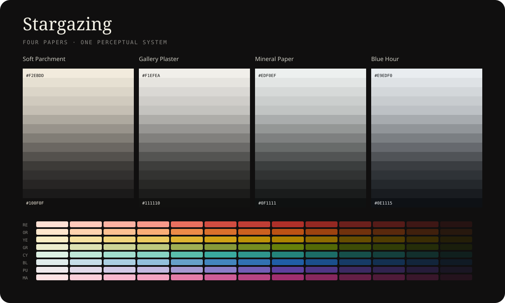

# Stargazing



Stargazing is a four-family color system for prose, code, and interfaces. It keeps the perceptual structure and complete accent palette of [Flexoki 2](https://stephango.com/flexoki), while replacing its yellow paper/base family with four coordinated neutral families.

- **Soft Parchment** — gently warm paper
- **Gallery Plaster** — balanced neutral paper
- **Mineral Paper** — cool mineral paper
- **Blue Hour** — distinctly cool blue-gray paper

Every family includes a complete light-to-dark base ramp, automatic light and dark semantic mappings, exact sRGB hex values, and measured OKLCH values. All eight Flexoki 2 accent ramps are included from 50 through 950.

## Use

```html
<link rel="stylesheet" href="dist/stargazing.css">
<body data-stargazing="gallery-plaster">
```

Add `data-mode="dark"` to the themed element for dark mode.

```css
body {
  background: var(--sg-bg);
  color: var(--sg-tx); /* body text must use primary text */
}
.caption { color: var(--sg-tx-2); }
.placeholder { color: var(--sg-tx-3); }
```

See [`docs/semantics.md`](docs/semantics.md) before implementing a UI. In particular, muted and faint colors are not substitutes for body text.

## Generate and validate

The project uses Python’s standard library only.

```sh
python3 scripts/generate.py
python3 scripts/validate.py
```

Generated artifacts:

- `dist/stargazing.css` — hex and OKLCH custom properties plus semantic mappings
- `dist/stargazing.json` — complete machine-readable palette
- `_images/stargazing-palette.svg` — repository palette preview

## Palette contents

| Family | Base values | Character |
|---|---:|---|
| Soft Parchment | 15 | Gently warm |
| Gallery Plaster | 15 | Balanced neutral |
| Mineral Paper | 15 | Cool mineral |
| Blue Hour | 15 | Blue-gray |

The shared accent system contains 104 colors: 13 values across red, orange, yellow, green, cyan, blue, purple, and magenta.

## Method

The base ramps preserve Flexoki’s exact OKLab lightness positions and interpolate each Stargazing paper/ink pair in OKLab. The accent values remain unchanged from Flexoki 2. See [`docs/methodology.md`](docs/methodology.md).

## Attribution

Stargazing is derived from Flexoki by Steph Ango, used under the MIT License. Flexoki’s original palette and documentation are available at [stephango.com/flexoki](https://stephango.com/flexoki) and [github.com/kepano/flexoki](https://github.com/kepano/flexoki).
